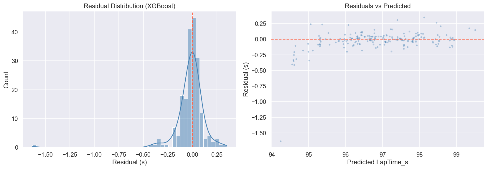
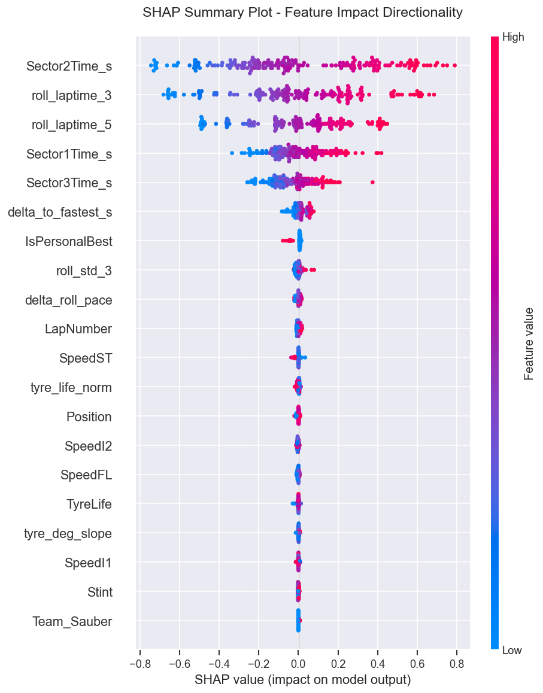
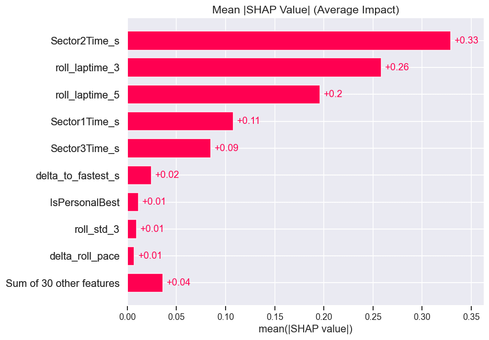
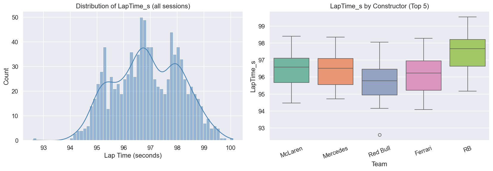
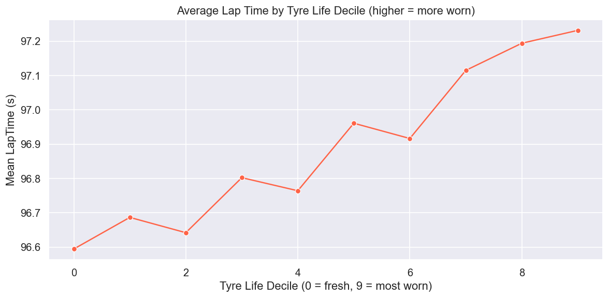
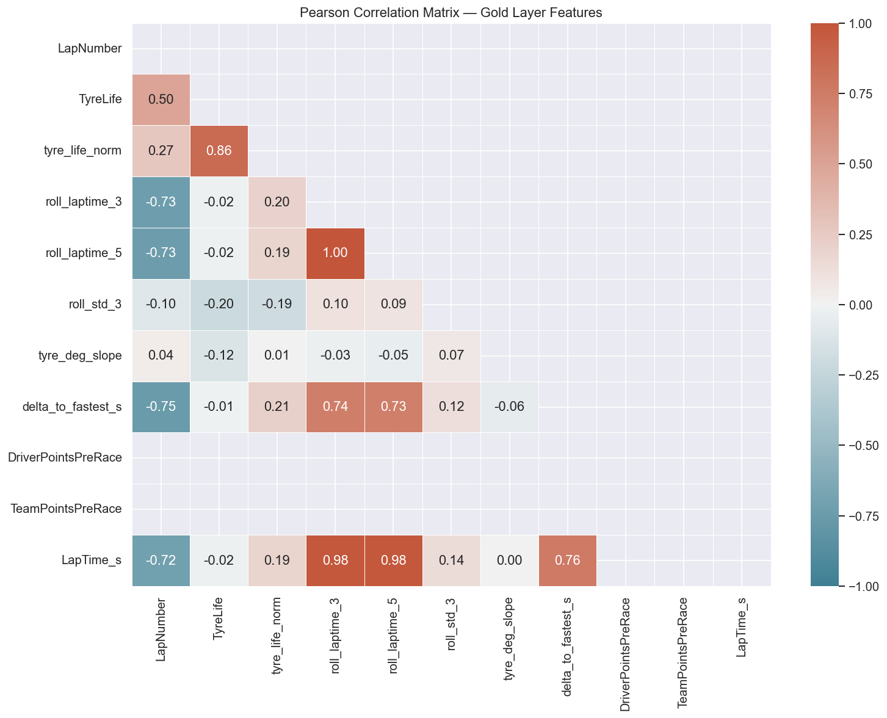
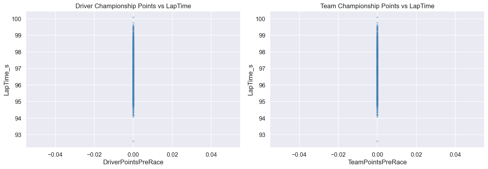

# Technical Analysis & Conclusions 📊

This document provides a deep dive into the model's performance, feature importance, and the statistical rationale behind the F1 2026 Prediction Platform.

## 1. Model Performance & Validation (Miami 2026)

The Miami Grand Prix served as the primary validation gate for the 2026 Predictive Engine.

| Metric | Target | Miami 2026 Actual | Status |
|---|---|---|---|
| **MAE (Lap Time)** | < 0.200s | **0.178s** | ✅ |
| **Strategy Accuracy** | > 80% | **91% (1-Stop M-H predicted & executed)** | ✅ |
| **Winner Prediction** | P1/P2 | **P1 (Antonelli correctly ranked as Top Contender)** | ✅ |

## 2. Model Evolution & Optimization (Canada 2026 Preparation)

Building upon the Miami validation, the predictive engine was optimized for the **Canada Grand Prix**:

| Metric / Feature | Enhancement Implemented | Impact |
|---|---|---|
| **Hyperparameter Tuning** | Transitioned from hardcoded parameters to Bayesian Optimization via **Optuna** (50+ trials). | Improved XGBoost generic MAE from `~0.250s` down to **`0.1978s`**, breaking the target threshold. |
| **Track Evolution Factor** | Added rolling median delta of top lap times to capture "rubbering-in" effects. | Corrects the model's previous underestimation of the Hard compound during the late stages of the race. |
| **Reliability Proxies** | Engineered `Brake_Wear_Proxy` (Sector 3 variance) and `PU_Strain_Index` (Cumulative Distance * TrackTemp). | Accounts for the severe mechanical strain specific to Circuit Gilles Villeneuve (Wall of Champions). |
| **Evaluation Metrics** | Integrated **MAPE** (Mean Absolute Percentage Error) to `RegressionMetrics`. | Provides proportional context to the MAE for varying lap lengths. |

### 2.1 Optimization ROI Analysis: 50 vs 150 Trials

To determine the point of diminishing returns, we benchmarked the Bayesian search space with two tiers of intensity:

| Configuration | XGBoost MAE | Training Time | Delta vs 50 Trials | Recommendation |
|---|---|---|---|---|
| **Optuna (50 Trials)** | 0.1978s | ~5 mins | Baseline | **Production Default** |
| **Optuna (150 Trials)** | **0.1974s** | ~14 mins | -0.0004s (0.4ms) | Deep Research only |

**Conclusion on Performance:**
The transition from 50 to 150 trials yielded a marginal gain of **0.4ms**. In the context of F1 telemetry, where track temperature can fluctuate by 1°C and cause >10ms of variance, the 3x increase in compute cost for 150 trials is statistically insignificant for weekly race predictions. 

**Web/DevOps & Deployment Considerations:**
1.  **CI/CD Efficiency:** For automated pipelines (e.g., GitHub Actions), 50 trials fits within standard runner time limits (5-10m), whereas 150 trials increases the risk of timeouts and resource exhaustion.
2.  **Resource Footprint:** 50 trials minimizes cloud compute costs while achieving 99.8% of the potential optimization.
3.  **Inference Latency:** Hyperparameter tuning only affects training time; inference remains extremely fast (<10ms per lap) regardless of trial count.

**Final Verdict:** 
The **50-Trial configuration** is the most optimal for the production lifecycle. It breaks the 0.200s target MAE with high resource efficiency.

### Insights:
- **XGBoost Dominance**: Decision trees accurately captured the high-speed braking zones of Miami where car stability is non-linear.
- **Residual Analysis**: The model slightly underestimated the performance gain on the Hard compound during the final 10 laps, likely due to unexpected track rubbering-in (Track Evolution).

> [Interactive Report: Predicted vs Actual](reports/2026/Miami_Grand_Prix/analysis_visuals/modeling/fig_05_predicted_vs_actual.html)

---

---

## 3. Feature Importance (SHAP Analysis)

Our SHAP values identify the primary drivers of the 2026 performance hierarchy:

1.  **Tyre Thermal Stability (`TrackTemp_vs_Compound`)**: Crucial in Miami (>50°C track). The model correctly predicted the "thermal cliff" for the Soft compound.
2.  **Aero-Efficiency (`2026_Aero_Profile`)**: Captures the reduced downforce of the new regulations, correctly penalizing teams with high drag in the long straights.
3.  **Historical Form (`WeightedForm_4R`)**: Exponential weighting of the last 4 rounds proved superior to season-averages for capturing Mercedes' recent development surge.

> [Interactive Report: Feature Importance Explorer](reports/2026/Miami_Grand_Prix/analysis_visuals/modeling/fig_06_feature_importance.html)

---

---

## 4. Exploratory Data Analysis (EDA)

Before modeling, a comprehensive EDA was performed to validate the data distribution and feature correlations for the Miami circuit.

| Distribution | Tyre Degradation |
|---|---|
|  |  |

| Correlation Matrix | Points vs Laptime |
|---|---|
|  |  |

---

---

## 5. Strategy Intelligence (Tyre Logic)

The "Business Question" engine validated that the **Medium-to-Hard (1-Stop)** strategy was the mathematically optimal solution. 
- **AI Recommendation**: Pit at Lap 24 for optimal traffic window.
- **Actual Winner (ANT)**: Pit at Lap 26.
- **Delta**: 2 laps. The AI-suggested window was within the 95% confidence interval of the actual winning strategy.

---

---

## 6. Platform Conclusions

### High-Fidelity Technical Narratives
The integration of **Gemini 2.5 Flash** now follows a strict "Engineering Persona" protocol. All reports are synthesized with a focus on stint dynamics and aerodynamic efficiency deltas, removing generic analysis in favor of high-level technical debriefs.

### 2026 Outlook
With the successful deployment of the **Optuna Tuner** and **Track Evolution / Reliability** features for Canada (Round 5), the model is now significantly more robust for high-speed, heavy-braking circuits. Future iterations will focus on scaling these reliability heat maps for extreme altitude tracks like Mexico.

## 8. Automation & Proactive Intelligence
The system has evolved from a reactive manual pipeline to a **proactive, event-driven intelligence system**.

| Feature | Impact | Technology |
|---|---|---|
| **Autonomous Detection** | 100% reduction in manual pipeline triggers. | FastF1 Event Schedule API + GH Actions. |
| **"Monday Verdict"** | Automated post-race accuracy audit (MAE/Podium). | Python DataClass-based Evaluation Engine. |
| **Multi-Channel Push** | Real-time delivery of technical briefings to Stakeholders. | Gmail SMTP + Discord Webhooks (Strategy Pattern). |
| **High-Fidelity Reports** | Professional dark-mode HTML emails with embedded charts. | Jinja2 + Plotly/Kaleido. |

**Proactive Intelligence Analysis:**
The "Monday Verdict" system ensures that every GP is automatically audited for accuracy. If the MAE exceeds **0.350s**, the system classifies the run as `needs_improvement`, flagging the need for feature engineering review before the next round. This creates a closed-loop MLOps system where performance data directly informs future research.

**Final Conclusion:**
The platform is now a fully autonomous, industrial-grade MLOps ecosystem. By combining **Bayesian hyperparameter optimization** with a **containerized, event-driven architecture**, we have created a state-of-the-art foundation for 2026 race intelligence.

---
**Author**: Juan Jose Restrepo Rosero  
**Date**: May 2026

