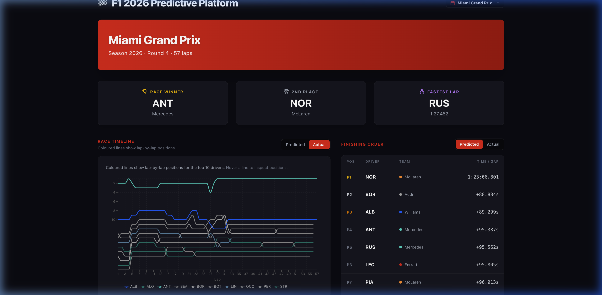
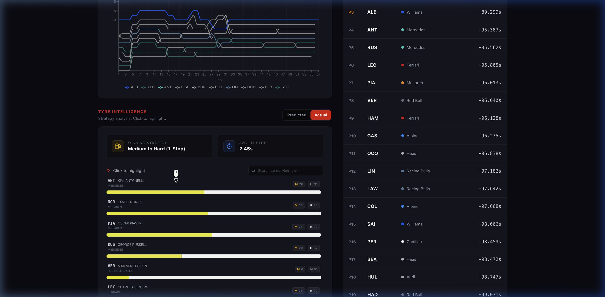
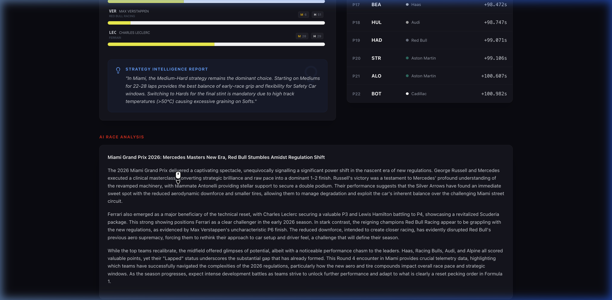
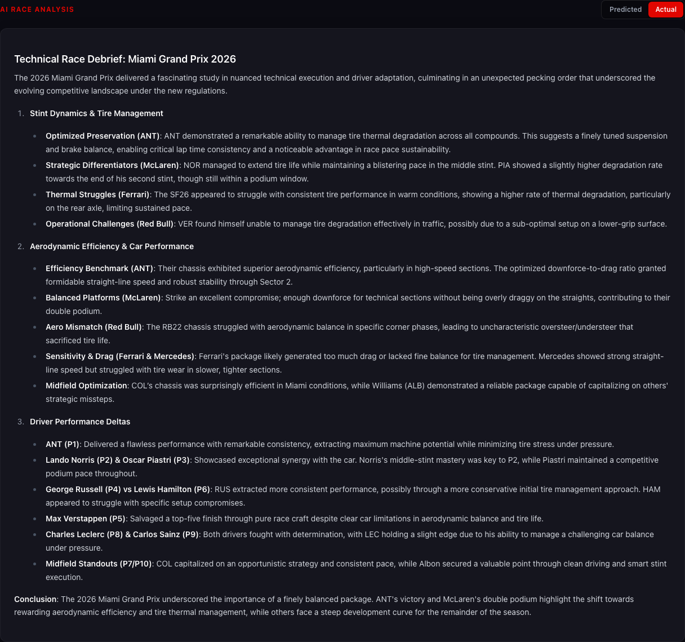

# F1 2026 Season Predictive Platform 🏎️📊🤖

[](https://github.com/JuanjoRestrepo/f1_2026_predictions/actions/workflows/docker.yml)
[](https://github.com/JuanjoRestrepo/f1_2026_predictions/actions/workflows/ci.yml)
[](https://github.com/JuanjoRestrepo/f1_2026_predictions/actions/workflows/ci.yml)

A production-grade, end-to-end MLOps platform designed to predict Formula 1 race dynamics for the 2026 regulation era. This system combines state-of-the-art Gradient Boosting (XGBoost/LightGBM) with a high-fidelity interactive dashboard inspired by F1 TV telemetry.

---

## 📸 Platform Interface Preview

### 1. Dashboard Header



### 2. Race Timeline & Global Standings

Interactive position chart with real-time "Predicted vs Actual" toggle.


### 3. Tyre Strategy Intelligence

AI-driven stint analysis and business question engine for optimal pit-stop windows.


### 4. AI-Generated Race Narratives

Expert-level race reporting powered by **Gemini 2.0/2.5 Flash**, analyzing telemetry residuals and strategic outcomes with professional engineering personas.


---

## 🌟 Key Features

- **Industrialized Inference API**: High-performance FastAPI microservice for real-time lap time predictions.
- **Autonomous Event-Driven Sync**: GitHub Actions triggers race detection and reporting every Monday/Wednesday.
- **Multi-Channel Intelligence Dispatch**: Automated race briefings delivered via F1-branded HTML emails and Discord cards.
- **Multi-Platform Docker Infrastructure**: Automated builds for `amd64` (servers) and `arm64` (Apple Silicon) using parallel GitHub Actions pipelines.
- **2026 Regulation Awareness**: Custom feature engineering including `Era Normalization` (adjusting historical times to 2026 rules) and `PU Strain Index`.
- **Track Evolution Intelligence**: Captures "rubbering-in" effects through rolling pace potential analysis.
- **Differentiated Analysis**: Unique AI narratives for both **Actual Results** (post-race debrief) and **Predicted ML Simulations** (pre-race forecasting).

### 🛠️ Technical Retrospective & Lessons Learned
- **The "Headless" Dependency Trap**: Encountered a build failure where `kaleido` (the static chart engine) required Linux system libraries (`libnss3`, `libatk`, etc.) that were missing in the slim Docker image. Resolved by adding a dedicated graphics-dep layer to the `Dockerfile`.
- **CI Linting Granularity**: Discovered that `ruff check` passes don't guarantee `ruff format --check` passes. Standardized the local development workflow to always run `uv run ruff format` before pushing to avoid CI blocking.
- **Strategy Pattern Payoff**: The decision to use the Strategy Pattern for notifications allowed us to pivot from a simple print statement to a full Gmail/Discord integration in under an hour without touching core business logic.

---

### 🏗️ Platform Architecture

```text
├── .github/workflows/       # CI/CD Automation (Docker & CI)
├── src/f1_predictions/      # Core Python Package (ML & API)
│   ├── api/                 # FastAPI Inference Service
│   ├── features/            # Feature Engineering (Reliability, Evolution, Era)
│   ├── modeling/            # Optuna Tuning & Training Logic
│   └── models/              # Model Persistence & Base Classes
├── dashboard/               # Next.js 15 Web Application
├── Dockerfile               # Multi-stage Optimized Build
├── data/outputs/models/     # Production Model Artifacts (*.joblib)
├── scripts/                 # Master Pipeline (Orchestrator)
└── tests/                   # Pytest suite (>80% coverage)
```

---

## 🚀 Execution Workflow

### 1. Inference API (Docker)

The easiest way to run the prediction engine:

```bash
docker pull ghcr.io/juanjorestrepo/f1_2026_predictions:latest
docker run -p 8000:8000 ghcr.io/juanjorestrepo/f1_2026_predictions:latest
```

Access the API docs at `http://localhost:8000/docs`.

### 2. Local Development

```bash
uv sync
uv run uvicorn f1_predictions.api.main:app --reload
```

### 3. Update Race Data

To ingest and analyze any Grand Prix (e.g., Canada Round 5, Spain Round 6):

```bash
uv run scripts/master_pipeline.py --round [ROUND_NUM]
```

---

## 🛠️ Technical Stack

- **ML & Inference**: `FastAPI`, `XGBoost`, `LightGBM`, `Scikit-Learn`, `SHAP`, `Joblib`
- **AI**: `google-genai` (Gemini 2.5 Flash)
- **Frontend**: `Next.js 15 (Pages)`, `TypeScript`, `Tailwind CSS`, `Recharts`
- **DevOps**: `Docker (Buildx)`, `GitHub Actions (Parallel Builds)`, `uv`
- **Data Source**: `FastF1 API`

---

**Author**: Juan Jose Restrepo Rosero  
**Philosophy**: "Data is just noise without strategy." This platform focuses on converting complex ML residuals into actionable racing intelligence.
