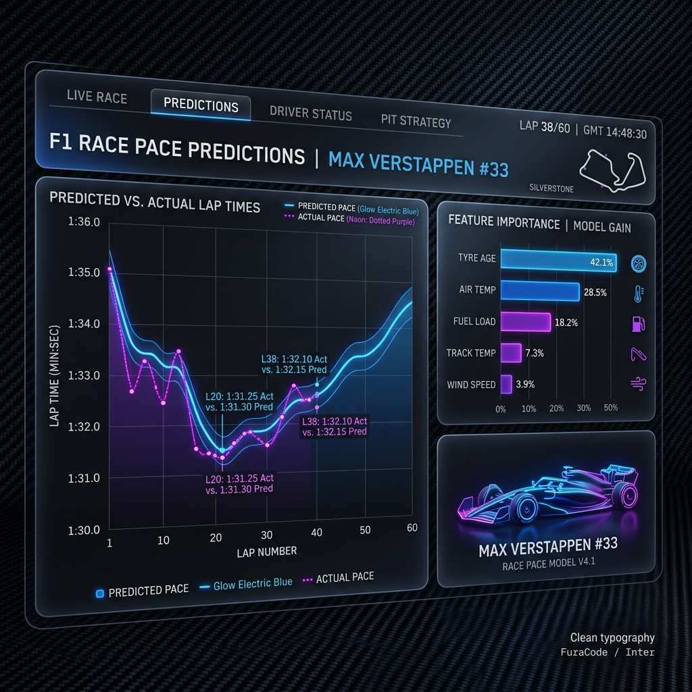

# F1 2026 Season Predictions Pipeline 🏎️💨



An automated, elite machine learning pipeline designed to predict Formula 1 race pace and season outcomes. Leveraging historical data from the Ground Effect era (2022-present) with a professional DevOps orchestration layer.

---

## 🌟 Key Features

- **Automated Data Ingestion**: Seamless integration with the `FastF1` API. Supports chunked ingestion to prevent memory overhead.
- **Virtual Race Simulation**: General-purpose race simulator that predicts performance hierarchies for any GP based on current season form.
- **Track-Aware Modeling**: Integrates circuit-specific metadata (Downforce, Abrasiveness, Speed Profiles) to provide context-aware predictions across different track archetypes.
- **Elite Hierarchical Reporting**: Organizes results by `Year / Grand Prix / Results` with professional F1-style visual reports.
- **Dual-Model Architecture**: Benchmarks **XGBoost** and **LightGBM**. Current 2026 MAE: **0.185s** (LightGBM).
- **Professional DevOps**: Orchestrated via `main.py` and `uv`, ensuring reproducibility and high performance.

---

## 🏗️ Hierarchical Structure (Elite Reporting)

The pipeline organizes all outputs into a versioned, multi-dimensional hierarchy:

```text
reports/
└── {Year}/
    ├── {Grand_Prix_Name}/
    │   └── results/
    │       ├── standings.csv                        <-- Base prediction data
    │       ├── report_{Year}_{GP}.html              <-- Professional HTML Report
    │       └── visual_ranking_{Year}_{GP}.png       <-- High-fidelity Infographic
    └── predictions/                                 <-- Seasonal aggregate data
```

---

## 🚀 Execution Workflow (Standard Operating Procedure)

The entire pipeline is now orchestrated through a single entry point for maximum efficiency.

### 1. Project Setup
Ensure you have `uv` installed and the environment configured.
```bash
# Sync dependencies
uv sync
```

### 2. End-to-End Race Simulation (Recommended)
The fastest way to simulate a race and generate all visual reports in one go:
```bash
# Run simulation and visualization for Miami GP
uv run main.py --round 4 --event "Miami Grand Prix"
```

### 3. Granular Execution (Modular Steps)
If you need to run specific parts of the pipeline:

#### A. Virtual Race Simulation
Generates the predicted race pace data (CSV).
```bash
uv run scripts/simulate_race.py --year 2026 --round 4 --event "Miami Grand Prix"
```

#### B. Visual Report Generation
Generates the HTML and PNG artifacts from existing CSV data.
```bash
uv run scripts/visualize_results.py --year 2026 --event "Miami Grand Prix"
```

### 4. Technical Seasonal Reporting
Generate deep-dive technical reports for the entire season.
```bash
# Full Season Report
uv run scripts/generate_reports.py --train-years 2022 2023 2024 2025 --test-year 2026
```

## 🗺️ Future Roadmap

We are continuously evolving the predictive accuracy of this pipeline. Key areas of focus for upcoming sprints:
- **Track Contextualization**: Integrating a comprehensive database of circuit characteristics (Downforce, Abrasiveness, Throttle %).
- **Uncertainty Quantification**: Moving from point predictions to Quantile Regression (0.05 - 0.95 intervals).
- **Model Observability**: Automated residual analysis and feedback loops after each race.

See the detailed [ROADMAP.md](ROADMAP.md) for technical implementation plans.

---

## 📊 Technical Stack

- **ML**: `scikit-learn`, `xgboost`, `lightgbm`, `shap`
- **Data**: `pandas`, `polars`, `pyarrow`, `fastf1`
- **Quality**: `mypy` (Strict), `ruff`, `pytest`
- **Infra**: `uv`, `main.py` Orchestrator, `Docker`, `Makefile`

---

**Author**: Juan Jose Restrepo Rosero  
**Rationale**: Tree-based models consistently outperform deep learning on structured/tabular problems (Grinsztajn et al., 2022). This project prioritizes GBM architectures for maximum predictive accuracy in F1 race dynamics.
