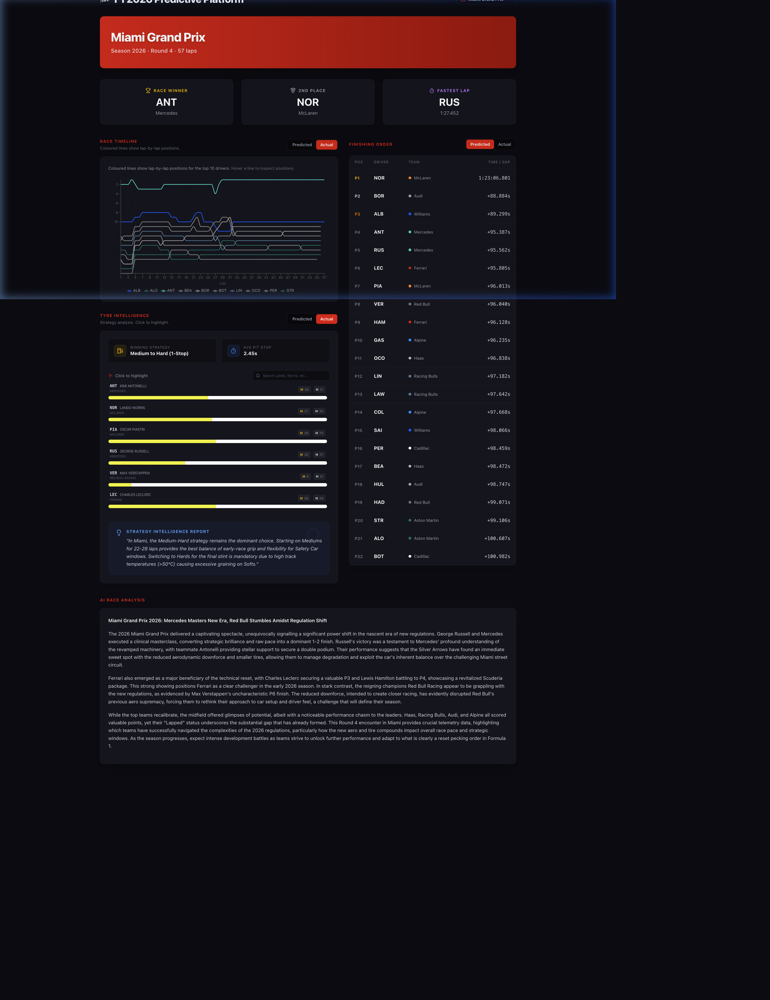

# F1 2026 Season Predictive Platform 🏎️📊🤖



A production-grade, end-to-end MLOps platform designed to predict Formula 1 race dynamics for the 2026 regulation era. This system combines state-of-the-art Gradient Boosting (XGBoost/LightGBM) with a high-fidelity interactive dashboard inspired by F1 TV telemetry.

---

## 🌟 Key Features

- **Interactive AI Dashboard**: A modern, dark-mode web interface built with **Next.js 15** and **Tailwind CSS**, providing real-time comparison between AI Predictions and Actual Race Telemetry.
- **Race Tyre Intelligence**: Deep-dive strategy analysis for all 22 drivers, featuring interactive stint timelines and "Business Question" logic to identify winning strategies.
- **Automated MLOps Pipeline**: Orchestrated via **GitHub Actions** and `master_pipeline.py`. Automated data ingestion from FastF1, model execution, and artifact deployment.
- **Virtual Race Simulation**: Simulates lap-by-lap position changes based on predicted race pace, visualizing the "Predicted vs Actual" delta in real-time charts.
- **Track-Aware Modeling**: Integrates circuit-specific metadata (Downforce, Abrasiveness, Speed Profiles) to provide context-aware predictions.
- **Professional Tooling**: Powered by `uv` for lightning-fast dependency management and `Ruff` for strict code quality enforcement.

---

## 🏗️ Platform Architecture

The project follows a **Medallion Architecture** (Bronze/Silver/Gold) for data processing, delivering artifacts to a dynamic web frontend:

```text
├── .github/workflows/       # CI/CD Automation (GitHub Actions)
├── dashboard/               # Next.js 15 Web Application
├── scripts/                 # Master Pipeline & Generation Scripts
├── reports/                 # Hierarchical Data Store (Versioned JSON/CSV)
│   └── 2026/
│       ├── summaries/       # Dashboard-ready JSON Artifacts (Round-based)
│       └── {Grand_Prix}/    # Deep-dive ML Reports & Raw Predictions
└── src/                     # Core ML Engine (XGBoost/LightGBM)
```

---

## 🚀 Execution Workflow

### 1. Local Development
```bash
# Sync environment
uv sync

# Run dashboard locally
cd dashboard && npm run dev
```

### 2. Update Race Data (The "Master Pipeline")
To ingest data for a new Grand Prix (e.g., Canada, Round 5):
```bash
# Manually via CLI
uv run scripts/master_pipeline.py --round 5

# OR via GitHub Actions (Recommended)
# Go to GitHub Actions -> "Update F1 2026 Data" -> Run Workflow
```

---

## 📊 Interactive Intelligence

The dashboard features several high-fidelity modules:
- **Predicted vs Actual Finishing Order**: Validating the AI's ranking against real results.
- **Position Timeline**: Interactive Recharts-based visualization of lap-by-lap positions.
- **Tyre Stint Map**: Visual breakdown of tire compounds and pit stop efficiency for the entire grid.
- **AI Narrative Analysis**: Auto-generated race reports using LLMs (Gemini) based on ML output.

---

## 🗺️ Roadmap Status

- ✅ **Phase 1-4**: Core ML Predictive Engine & MLOps Feedback Loops.
- ✅ **Phase 5 (Interactive Visualization)**: Full-stack Dashboard implementation.
- ✅ **Phase 6 (Strategy Intelligence)**: Interactive Tyre and Pit Stop analysis.
- ✅ **Phase 7 (Multi-GP Scaling)**: Dynamic routing and automated cloud ingestion via GitHub Actions.
- 🚀 **Phase 8 (Real-time Prediction)**: Integrating live timing sockets for "In-Race" AI re-calculation (Experimental).

---

## 🛠️ Technical Stack

- **ML**: `XGBoost`, `LightGBM`, `Scikit-Learn`, `SHAP`
- **Frontend**: `Next.js 15 (Pages)`, `TypeScript`, `Tailwind CSS`, `Recharts`, `Lucide React`
- **Automation**: `GitHub Actions`, `Docker`, `uv`
- **Data Source**: `FastF1 API`, `OpenF1`

---

**Author**: Juan Jose Restrepo Rosero  
**Philosophy**: "Data is just noise without strategy." This platform focuses on converting complex ML residuals into actionable racing intelligence.
