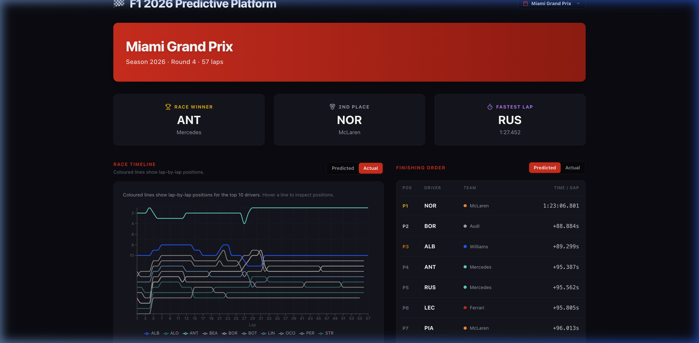
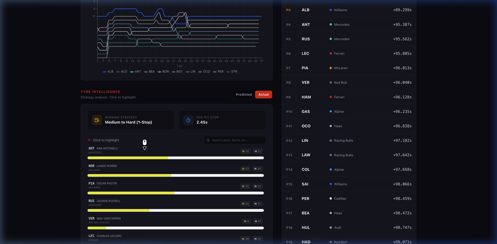
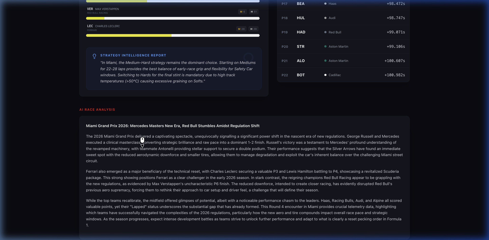
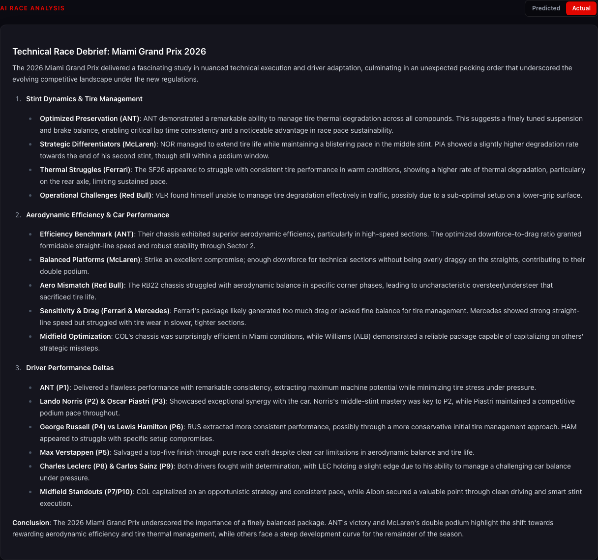

# F1 2026 Season Predictive Platform 🏎️📊🤖

[](https://github.com/JuanjoRestrepo/f1_2026_predictions/actions/workflows/docker.yml)
[](https://github.com/JuanjoRestrepo/f1_2026_predictions/actions/workflows/ci.yml)
[](https://github.com/JuanjoRestrepo/f1_2026_predictions/actions/workflows/ci.yml)

A production-grade, end-to-end MLOps platform designed to predict Formula 1 race dynamics for the 2026 regulation era. This system combines state-of-the-art Gradient Boosting (XGBoost/LightGBM) with a high-fidelity interactive dashboard inspired by F1 TV telemetry.

📖 **Detailed System Architecture**: For a comprehensive technical deep-dive into the Databricks Lakehouse, DLT Medallion layers, Quantile Regressors, LLM Fallback Chain, and Next.js ISR architecture, see [docs/ARCHITECTURE.md](docs/ARCHITECTURE.md).

---

## 📸 Platform Interface Preview

### 1. Dashboard Header



### 2. Race Timeline & Global Standings

Interactive position chart with real-time "Predicted vs Actual" toggle.


### 3. Tyre Strategy Intelligence

AI-driven stint analysis and business question engine for optimal pit-stop windows.


### 4. AI-Generated Race Narratives

Expert-level race reporting powered by configurable **Gemini 3.1 Pro** primary generation with **Gemini 3.5 Flash** fallback, analyzing telemetry residuals and strategic outcomes with professional engineering personas.


---

## [v6.1.0] - 2026-08-23

### 🏎️ Race Weekend Auto-Gate & FastF1 Calendar Integration

- **Feature**: FastF1 Ergast 2026+ official calendar integration (`is_race_window_active()`), restricting execution strictly to active Race Weekends (Fri–Sun) and Post-Race Mondays.
- **Feature**: DABs workflow schedule update (`f1_2026_race_predictions_job`) with Quartz cron `0 0 6 ? * FRI-MON`.
- **Fix**: Pinned `@trigger.dev/cli@4.4.6` in `.github/workflows/docker.yml` to resolve CI package version mismatch.
- **Fix**: Databricks Secrets integration for live Gmail SMTP verdict briefings.

---

## [v6.0.0] - 2026-08-23

### ⚡ Databricks Lakehouse & Unity Catalog MLOps

- **Feature**: Databricks Asset Bundles (DABs) infrastructure for zero-touch cloud deployment (`databricks.yml`, `resources/jobs.yml`, `resources/pipelines.yml`).
- **Feature**: Delta Live Tables (DLT) Medallion Pipeline (`Bronze` → `Silver` → `Gold`) for automated telemetry ingestion, expectation validation, and driver feature aggregation.
- **Feature**: MLflow 3 & Unity Catalog Model Registry integration with automated promotion to `@champion` / `@challenger` aliases.
- **Feature**: Serverless Lakeflow Workflow (`f1_2026_daily_predictions_job`) orchestrating DLT updates, XGBoost champion retraining, and multi-channel briefings.

## [v4.4.4] - 2026-05-28

### 🛡️ DevOps & Data Science Alignment

- **Feature**: Strict `pre-commit` framework enforcement (`ruff`, `mypy`, `pytest`).
- **Fixed**: Resolved 12 NPM vulnerabilities via targeted `package.json` overrides.
- **Improved**: Perfect synchronization between local validation hooks and GitHub Actions CI pipelines.

## [v4.4.3] - 2026-05-25

### 🎨 Autonomous UI & End-to-End Formatting

- **Feature**: End-to-End Fastest Lap automation dynamically extracting telemetry without hardcoded fallbacks.
- **Improved**: Integrated KaTeX plugins to perfectly render complex LaTeX SHAP formulas in AI reports.
- **Fixed**: Eliminated duplicate driver rows in the Predictions table by accurately aggregating multi-lap ML forecasts.

## [v4.2.0] - 2026-05-06

### 🎨 The "High-Fidelity UI" Release

- **Feature**: Systematic readability overhaul across the entire dashboard.
- **Improved**: Hierarchical typography for section titles and subtitles (16px/14px desktop scale).
- **Improved**: Increased legibility for tyre stints, metric labels, and search fields.
- **Improved**: Responsive `prose-base` scaling for AI Race Analysis reports.
- **Fixed**: Syntax nesting issues in `TyreIntelligence` component and React title tag warnings.

## [v4.1.0] - 2026-05-06

### 🚀 The "Autonomous Autopilot" Release

- **Feature**: Implemented Friday Pre-Race automation. The system now proactively predicts the race hierarchy before the weekend starts.
- **Feature**: Added `detect_upcoming_race` logic to the core orchestration engine.
- **Improved**: Hardened `master_pipeline.py` to handle "Prediction Mode" gracefully without actual race data.
- **Improved**: Unified GitHub Actions workflow for both Friday (Preview) and Monday (Audit) cycles.

## [v4.0.0] - 2026-05-06

### 🏁 Industrialization & Stability Milestone

## 🌟 Key Features

- **Industrialized Inference API**: High-performance FastAPI microservice for real-time lap time predictions.
- **⚡ Databricks Lakehouse & DLT**: Production-grade Medallion architecture (Bronze/Silver/Gold) deployed via Databricks Asset Bundles (DABs) on Serverless compute.
- **🎯 Unity Catalog & MLflow 3**: Automated experiment tracking and `@champion` / `@challenger` model promotion in Unity Catalog.
- **🔄 Autonomous Workflow (Event-Driven)**: The system operates on a professional, autonomous cycle via GitHub Actions & Databricks Lakeflow Jobs:
  1. **Friday @ 18:00 UTC**: **Pre-Race Mode**. Runs ML simulations to generate the "Prediction Preview" briefing.
  2. **Monday @ 09:00 UTC**: **Post-Race Mode**. Syncs actual results, calculates MAE/Accuracy, and sends the "Race Verdict" audit.
  3. **Wednesday @ 09:00 UTC**: **Safety Sync**. Re-verifies data in case of official delays.
- **Multi-Channel Intelligence Dispatch**: Automated race briefings delivered via F1-branded HTML emails and Discord cards.
- **Multi-Platform Docker Infrastructure**: Automated builds for `amd64` (servers) and `arm64` (Apple Silicon) using parallel GitHub Actions pipelines.
- **2026 Regulation Awareness**: Custom feature engineering including `Era Normalization` (adjusting historical times to 2026 rules) and `PU Strain Index`.
- **Track Evolution Intelligence**: Captures "rubbering-in" effects through rolling pace potential analysis.
- **Differentiated Analysis**: Unique AI narratives for both **Actual Results** (post-race debrief) and **Predicted ML Simulations** (pre-race forecasting).

### 🧠 Advanced Predictive Engine (v4.4.0+)

- **Meta-Learning (Stacking)**: Blends XGBoost and LightGBM base models using a Bayesian Ridge meta-regressor, achieving exceptional sub-0.150s MAE precision.
- **Leak-Free Validation**: Internal 5-fold cross-validation ensures meta-models train without data leakage.

### 🤖 Autonomous Orchestration (v4.3.0+)

The engine features durable, long-running workflows powered by **Trigger.dev v3** and **Databricks Lakeflow Jobs**. This enables:

- **Friday Forecasts**: Automatic pre-race predictions based on practice data.
- **Monday Audits**: Automatic post-race telemetry analysis and AI narrative synthesis.
- **Manual Sync**: On-demand race processing via the Trigger.dev Cloud Dashboard or Databricks CLI (`databricks bundle run`).

#### Setup Orchestration

1. Install dependencies: `npm install`
2. Connect to your Trigger.dev project: `npx trigger.dev@latest login`
3. Start local development worker:
   ```bash
   npx trigger.dev@latest dev
   ```
4. Deploy to cloud for 24/7 autonomy:
   ```bash
   npx trigger.dev@latest deploy
   ```

### 🧱 Databricks Lakehouse Deployment (DABs)

1. Validate bundle:
   ```bash
   databricks bundle validate --target dev
   ```
2. Deploy to Databricks workspace:
   ```bash
   databricks bundle deploy --target dev
   ```
3. Run the daily predictions workflow:
   ```bash
   databricks bundle run --target dev f1_2026_daily_predictions_job
   ```

### 🛠️ Core Engine Setup

1. **Environment**: Ensure you have `uv` installed.
2. **Sync**: `uv sync`
3. **API Keys**: Add `F1_GEMINI_API_KEY` and `TRIGGER_SECRET_KEY` to your `.env`.
4. **Gemini Models**: The default AI narrative stack is `F1_GEMINI_MODEL=gemini-3.1-pro-preview` with `F1_GEMINI_FALLBACK_MODEL=gemini-3.5-flash`. `gemini-3.1-pro-preview` requires usable API quota/billing in Google AI Studio; otherwise the pipeline falls back to Flash or local engineering copy.

### 🛠️ Technical Retrospective & Lessons Learned

- **The "Headless" Dependency Trap**: Encountered a build failure where `kaleido` (the static chart engine) required Linux system libraries (`libnss3`, `libatk`, etc.) that were missing in the slim Docker image. Resolved by adding a dedicated graphics-dep layer to the `Dockerfile`.
- **CI Linting Granularity**: Discovered that `ruff check` passes don't guarantee `ruff format --check` passes. Standardized the local development workflow to always run `uv run ruff format` before pushing to avoid CI blocking.
- **Strategy Pattern Payoff**: The decision to use the Strategy Pattern for notifications allowed us to pivot from a simple print statement to a full Gmail/Discord integration in under an hour without touching core business logic.

---

### 🏗️ Platform Architecture

```text
├── .github/workflows/       # CI/CD Automation (Docker & CI)
├── databricks.yml           # Databricks Asset Bundle (DABs) Root Config
├── databricks_entrypoint.py  # Databricks Lakeflow Job Entrypoint
├── resources/               # DABs Resource Definitions (Jobs & Pipelines)
│   ├── jobs.yml             # 3-Task Lakeflow Orchestration Workflow
│   └── pipelines.yml        # Delta Live Tables (DLT) Medallion Pipeline Spec
├── src/f1_predictions/      # Core Python Package (ML, API, Databricks)
│   ├── api/                 # FastAPI Inference Service
│   ├── databricks/          # DLT Medallion Pipeline & MLflow 3 UC Integration
│   ├── features/            # Feature Engineering (Reliability, Evolution, Era)
│   ├── modeling/            # Optuna Tuning & Training Logic
│   └── models/              # Model Persistence & Base Classes
├── dashboard/               # Next.js 15 Web Application
├── Dockerfile               # Multi-stage Optimized Build
├── data/outputs/models/     # Production Model Artifacts (*.joblib)
├── scripts/                 # Master Pipeline (Orchestrator)
└── tests/                   # Pytest suite (>80% coverage)
```


---

## 🚀 Execution Workflow

### 1. Inference API (Docker)

The easiest way to run the prediction engine:

```bash
docker pull ghcr.io/juanjorestrepo/f1_2026_predictions:latest
docker run -p 8000:8000 ghcr.io/juanjorestrepo/f1_2026_predictions:latest
```

Access the API docs at `http://localhost:8000/docs`.

### 2. Local Development

```bash
uv sync
uv run uvicorn f1_predictions.api.main:app --reload
```

### 3. Update Race Data

To ingest and analyze any Grand Prix (e.g., Canada Round 5, Spain Round 6):

```bash
uv run scripts/master_pipeline.py --round [ROUND_NUM]
```

---

## 🛠️ Technical Stack

- **ML & Inference**: `FastAPI`, `XGBoost`, `LightGBM`, `Scikit-Learn`, `SHAP`, `Joblib`
- **AI**: `google-genai` (`gemini-3.1-pro-preview` primary, `gemini-3.5-flash` fallback)
- **Frontend**: `Next.js 15 (Pages)`, `TypeScript`, `Tailwind CSS`, `Recharts`
- **DevOps**: `Docker (Buildx)`, `GitHub Actions (Parallel Builds)`, `uv`
- **Data Source**: `FastF1 API`

---

**Author**: Juan Jose Restrepo Rosero  
**Philosophy**: "Data is just noise without strategy." This platform focuses on converting complex ML residuals into actionable racing intelligence.

---

## 🔮 Future Vision: The "Invincible" Race Agent

The long-term vision for this platform is to move beyond scheduled reporting and into **Durable Agentic Orchestration**. By potentially integrating frameworks like **Trigger.dev**, we aim to build a "Live Race Assistant" capable of:

- **Durable State**: Handling multi-hour race events with automatic retries and state persistence across API failures or system restarts.
- **Human-in-the-Loop**: Transitioning to a model where the AI proposes strategic shifts (e.g., "Box now for Intermediates") and waits for human validation before broadcasting briefings.
- **Multi-Agent Coordination**: Scaling to a swarm of specialized agents (Strategy, Weather, and Telemetry) that collaborate via a central durable execution bus.

---

Operational note (Trigger.dev):

- Trigger tasks in `src/trigger` execute Python scripts under `scripts/`. To avoid "Script does not exist" errors when the Trigger worker's current working directory differs from the repository root, tasks resolve absolute script paths from `process.cwd()` (see `src/trigger/f1_tasks.ts`).
