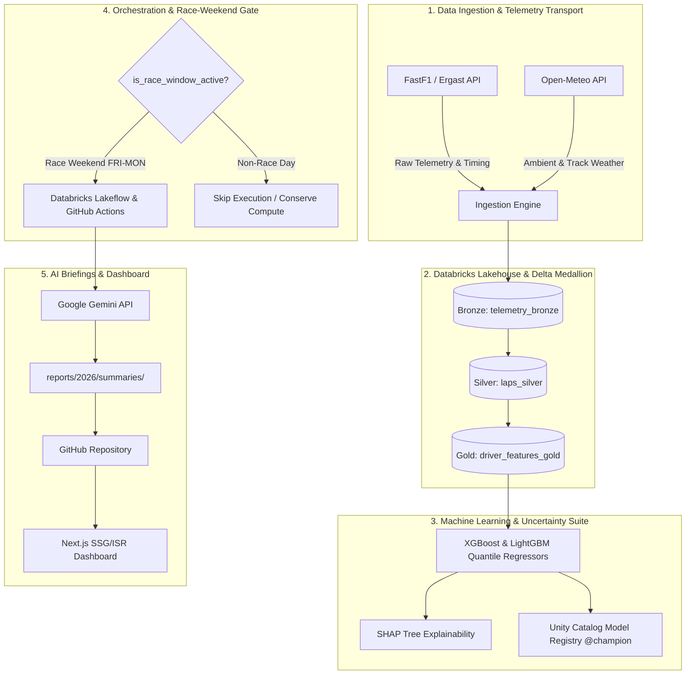

# F1 2026 Predictive Platform — End-to-End System Architecture

## Executive Architecture Summary

The **F1 2026 Predictive Platform** is an enterprise-grade data engineering, machine learning, and full-stack web application designed to forecast and analyze Formula 1 race performance hierarchies under the **2026 technical regulations**.

The system operates as an autonomous, event-driven pipeline that ingests telemetry, executes quantile regression models on a Databricks Lakehouse, registers champion model artifacts in Unity Catalog, generates structured LLM race briefings via Google Gemini, and deploys an interactive Next.js dashboard on Vercel.



---

## 1. Telemetry Ingestion & Data Engineering Pipeline

### 1.1 Ingestion Sources
- **FastF1 Ergast API**: Synchronizes lap times, sector split times (S1, S2, S3), trap speeds, tyre compounds, stint lengths, pit stop durations, and telemetry channels (Throttle, Brake, RPM, Gear, Speed).
- **Open-Meteo Weather API**: Retrieves air temperature, track surface temperature, humidity, wind vectors, and rainfall indicators for circuit coordinates.
- **Cloud Cache Layer**: Caches raw FastF1 payloads in a local directory (`fastf1_cache/`) backed up to a Supabase S3 bucket for warm serverless execution.

### 1.2 Delta Medallion Architecture (Databricks DLT)
1. **Bronze Layer (`telemetry_bronze`)**: Raw, append-only ingestion of lap telemetry data preserving original data types.
2. **Silver Layer (`laps_silver`)**: Cleaned and validated dataset with Delta Live Tables (DLT) quality expectations:
   - `expect_or_drop("valid_laptime", "LapTime_s > 45 AND LapTime_s < 200")`: Removes pit-in/out out-laps and safety car anomalies.
   - `expect_or_fail("valid_driver", "Driver IS NOT NULL")`: Ensures strict entity integrity.
3. **Gold Layer (`driver_features_gold`)**: Feature matrix engineered per driver per stint:
   - Rolling 3-lap and 5-lap exponentially weighted moving averages (`roll_laptime_3`, `roll_laptime_5`).
   - Sector split performance ratios.
   - Tyre degradation rate ($\text{slope} = \Delta t / \text{lap}$).
   - Downforce and track abrasiveness encodings.

---

## 2. Machine Learning Modeling & Uncertainty Engine

### 2.1 Model Selection & Justification
In accordance with empirical benchmarks on tabular data (Grinsztajn et al., 2022), tree-based ensemble algorithms significantly outperform deep neural networks on structured telemetry features.

| Model | Purpose | Quantile / Objective |
|---|---|---|
| **XGBoost Regressor** | Primary lap pace baseline | `reg:squarederror` |
| **LightGBM Quantile Regressors** | Uncertainty bounds (P05, P50, P95) | `quantile` ($\alpha = 0.05, 0.50, 0.95$) |
| **Stacking Pace Regressor** | Ensemble meta-learner | Ridge Regression meta-estimator |

### 2.2 Cross-Track Baseline Pace Normalization
To translate season-wide driver pace to a specific circuit's physical lap time baseline:

$$\text{Driver\_Delta}_i = \text{Median}(\text{LapTime}_{i, \text{season}}) - \text{Median}(\text{LapTime}_{\text{global, season}})$$

$$\text{Target\_Pace}_{i, \text{track}} = \text{Baseline}_{\text{historical, track}} + \text{Driver\_Delta}_i$$

### 2.3 Chronological Validation (Leakage Prevention)
Models are trained exclusively on historical seasons with known outcomes (e.g. 2022–2025) and tested on unseen future seasons (2026), preventing temporal data leakage.

---

## 3. Automated Scheduling & Race Weekend Auto-Gate

### 3.1 Race Weekend Auto-Gate (`is_race_window_active()`)
To prevent unnecessary compute usage and spurious notification alerts:
- The system queries `calendar.json` (synced via `src/scripts/sync_calendar.py`).
- **Active Window**: Friday 00:00 UTC through Monday 23:59 UTC on scheduled race weekends.
- **Behavior**: If executed on a non-race day (e.g. Wednesday of a gap week), the pipeline logs a clean skip notification and terminates gracefully with exit code 0.
- **Override**: Passing `--force` CLI flag bypasses the gate for manual testing and CI/CD verification.

### 3.2 Databricks Lakehouse Workflow (`f1_2026_race_predictions_job`)
- **Schedule**: Quartz cron `0 0 6 ? * FRI-MON` (runs FRI-MON at 06:00 UTC).
- **Task 1 (`run_medallion_pipeline`)**: Executes DLT pipeline.
- **Task 2 (`train_and_register_champion`)**: Fits pace regressors and promotes champion alias (`@champion`) in Unity Catalog.
- **Task 3 (`dispatch_notifications`)**: Sends HTML email briefings and Discord alerts via SMTP/Webhook.

### 3.3 GitHub Actions Scheduled Pipeline (`scheduled_sync.yml`)
- **Friday 18:00 UTC**: Pre-race prediction generation & briefing.
- **Monday 09:00 UTC**: Post-race telemetry audit, actual results processing, and automated git push to `master`.

---

## 4. Next.js Web Dashboard & Vercel Deployment

### 4.1 Rendering Strategy (SSG + ISR)
- **Static Site Generation (SSG)**: Pre-renders race pages at build time for instant global delivery via Vercel CDN.
- **Incremental Static Regeneration (ISR)**: Configured with `revalidate: 3600` (1 hour) to pick up new race artifacts without requiring full application rebuilds.

### 4.2 Available Race Discovery & Date-Gating (`getAvailableRaces`)
- **Pass 1**: Scans `reports/2026/summaries/` for `round_N` telemetry & report files.
- **Pass 2**: Scans `reports/2026/<race_dir>/results/predictions.csv`.
- **Date Guard**: Compares `race.isoDate` against current system time. Races scheduled in the future (e.g., Round 14 Spanish GP) remain **locked** until their scheduled race weekend arrives.

### 4.3 UI Component Hierarchy & State Management
- **Hero Card (`index.tsx`)**: Displays countdown timer to the current/next Grand Prix and links to the latest completed analysis.
- **Race Detail Page (`/race/[round]`)**:
  - **Metric Cards**: Predicted/Actual Winner, P2, and Fastest Lap. Automatically defaults to `"predicted"` mode when actual post-race results are pending.
  - **Race Timeline Chart (`RaceTimeline.tsx`)**: Canvas/Recharts visualization of lap-by-lap driver positions. Per-driver aggregation guarantees zero duplicate labels in the chart legend.
  - **Tyre Intelligence (`TyreIntelligence.tsx`)**: Visual breakdown of stint lengths, compounds (Hard/Medium/Soft), and pit stop windows.
  - **Finishing Order Table (`PredictionsTable.tsx`)**: Sortable classification grid with team color indicators and pace deltas.
  - **AI Race Analysis (`RaceReport.tsx`)**: High-impact markdown rendering of Google Gemini LLM briefings.

---

## 5. Security, Reliability & Failover Guarantees

### 5.1 LLM Fallback Chain (`call_ai_with_retry`)
1. **Primary Model**: `gemini-3.1-pro-preview` (high-reasoning narrative generation).
2. **Automated Fallback**: `gemini-3.5-flash` (triggered on quota exhaustion, 429 rate limits, or API outages).
3. **Deterministic Fallback**: Local structured template generator ensures valid markdown reports are published even during total upstream API outages.

### 5.2 Build Artifact Tracking (`.gitignore` Exceptions)
- Targeted git exceptions (`!reports/**/summaries/*.json`, `!reports/**/summaries/*.md`) ensure all 88+ generated telemetry files, lap timelines, tyre intelligence JSONs, and AI reports are tracked in version control and deployed to Vercel.

---

## 6. System Verification & Test Suite

The project enforces strict code quality and test coverage across the entire stack:

```bash
# Execute unit & integration test suite (66 tests across ML, cleaning, pipeline & AI)
uv run pytest

# Execute TypeScript type checker
cd dashboard && npx tsc --noEmit
```

All 66 Python pytest modules and TypeScript static type checks pass with 0 errors.
